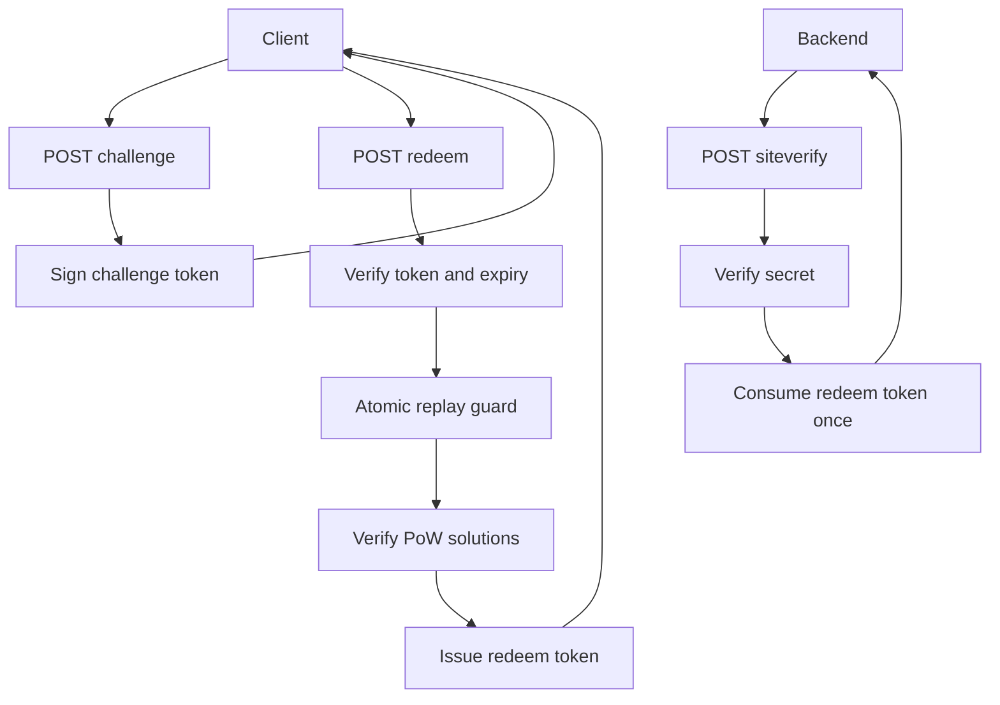

# gocap Architecture

`gocap` 是一个单机、内存态、可嵌入的 Go CAPTCHA 库。本文仅保留长期维护所需的架构信息。

## 1. 目标与边界

### 目标

- 以库形式嵌入业务服务（不需要独立 CAPTCHA 服务进程）
- 提供核心闭环：`challenge -> redeem -> siteverify`
- 保证关键安全语义：防重放 + 一次性消费

### 非目标（当前）

- 分布式一致性 / 多节点共享状态
- 持久化存储
- 管理后台、instrumentation、IP 地理库

## 2. 分层结构

```text
cap/              # 对外入口与配置
core/             # 领域逻辑（签发、校验、防重放）
store/            # 存储抽象
store/memstore/   # 单机内存实现
transport/http/   # HTTP 协议适配层
```

职责约束：

- `cap` 不承载业务逻辑，只做装配与对外 API
- `core` 不依赖具体 HTTP 框架
- `store` 通过接口隔离存储实现
- `transport/http` 只负责协议转换，不直接写业务规则

## 3. 核心数据流



## 4. 核心语义（必须保持）

- challenge token payload：`sk,n,c,s,d,exp,iat`
- challenge 防重放：`TryMarkChallengeSigUsed` 原子检查+写入
- siteverify 一次性消费：`ConsumeRedeemToken` 原子读删
- PoW 校验：服务端按 token 重建 challenge 后验证 `solutions`

## 5. HTTP 协议约束

路径仅允许两种格式：

- `/{siteKey}/{action}`
- `/cap/{siteKey}/{action}`

`action` 仅允许：

- `challenge`
- `redeem`
- `siteverify`

解码策略：

- `redeem`：非严格 JSON（允许扩展字段，提升客户端兼容性）
- `siteverify`：严格 JSON（拒绝未知字段）
- 请求体大小限制：默认 1 MiB
- 拒绝多个 JSON payload 拼接

错误响应：

```json
{ "success": false, "code": "bad_request", "error": "..." }
```

## 6. 存储模型（memstore）

关键内存状态：

- `Sites`
- `usedChallengeSig`
- `redeemTokens`
- `rateWindows`

并发模型：

- `sync.RWMutex`
- 关键路径使用原子语义方法（防 TOCTOU）

过期策略：

- 周期 GC
- 读路径惰性清理

## 7. 默认配置

- challenge TTL：15 分钟
- redeem TTL：2 小时
- 默认限流：仅 `challenge` 开启
- `siteverify` 默认不限流（可配置开启）

## 8. 质量门槛

必须通过：

```bash
go test ./...
go test -race ./...
```

关键用例：

- challenge 过期
- redeem 串行/并发重放
- siteverify 二次消费
- 路由与协议边界（路径、405、JSON、body limit）

## 9. 演进方向

- 引入 Redis store（保持 `store.Store` 接口稳定）
- 增强框架适配（Gin/Chi/Fiber）
- 增加可观测性钩子（日志/指标）
